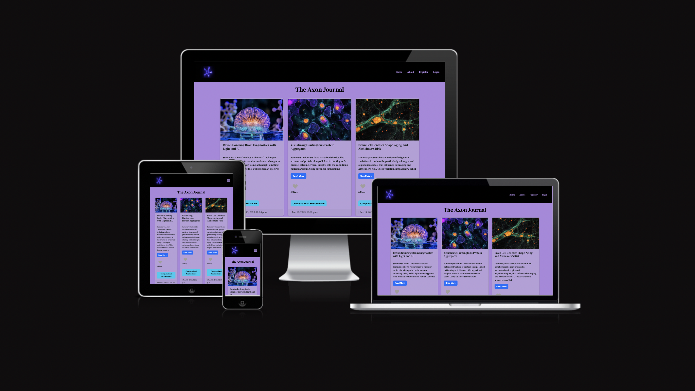

# **Neuroscience Blog Website**

## **Overview**

Responsive design
- Desktop: Options spread across navbar
- Ipad and iphone: Options revealed in dropdown burger icon
- Clear Navigation 
- No loss of functionality

### **Purpose**

This project is a blog website aimed at individuals interested in neuroscience, including students, professors, and academics. The goal is to create an engaging platform for users to share, discuss, and learn about neuroscience through blog posts, likes, and other interactions. The site provides an opportunity for users to contribute their knowledge, engage with community discussions, and learn from peers in the field.

### **Target Audience**

The website is targeted at those who are curious about neuroscience, including high school students, university students and professors 

## **User Stories**

### **Must-Have User Stories**

As a registered user, \
I want to create and publish blog posts related to neuroscience, \
so that I can share my knowledge with the community.

Acceptance Criteria:

* Logged-in users should see a "Create Post" button on their dashboard.
* Users must provide a title, content, and select at least one category (e.g., Cognitive Neuroscience).
* Users can optionally add tags and upload a featured image.
* Posts are saved as drafts by default and require explicit action to publish.
* Only published posts appear on the homepage.

As a neuroscience enthusiast (student or academic), \
I want to create an account on the blog, \
so that I can contribute posts, comment, and engage with other users.

Acceptance Criteria:

* Users can navigate to the registration page from the homepage.
* Users must provide a username, email, and password.
* Passwords must meet security requirements (e.g., minimum 8 characters, at least one number).
* The system should send a confirmation email after registration.
* Users should be redirected to the homepage upon successful registration.

As a logged-in user, \
I want to be able to like and unlike on blog posts, \
so that I can engage with the author and other readers.

Acceptance Criteria:

* A like count should appear below each post for logged-in users.
* They should be able to like the post, increasing the like count

### **Should-Have User Stories**

As a neuroscience student, \
I want to filter posts by specific categories or tags, \
so that I can find relevant content more easily.

Acceptance Criteria:

* Categories should appear as a dropdown menu in the navigation bar.
* Tags should be displayed as clickable links on each post.
* Clicking a category or tag should filter posts to only display relevant ones.
* Pagination should work correctly when filtering by category or tag.

### **Could-Have User Stories**

As a neuroscience academic, \
I want to view profiles of other contributors, \
so that I can learn about their expertise and interests.

Acceptance Criteria:

* Clicking a user’s name on a post or comment redirects to their profile page.
* Profiles should display the user’s username, bio, and list of posts they’ve authored.
* Users can optionally share their academic affiliation and research interests.
* Profiles should not display sensitive data (e.g., email addresses).

## **Design Decisions**

### **Wireframes**

### User Friendly:

* Contrasting background to text
* Easy to read font
* Aesthetic colour palette

### 

## Database:

### Entity- relationship diagram:

Custom Models

* Neuroscience article- personalised to my blog by total likes
* Category/ tag- each article can be separated in to different topics eg Computational neuroscience, Psychiatry etc. There is a page for each tag

### Agile Methodology:

* Used Github Project Board to track completion of user stories

## **Code Quality + testing procedures**

* Passed the Python linter , adherence to PEP 8 Guidelines 
* Regular manual testing e.g. adding posts

# 

**Manual Testing:

*Focus: Tested real-world scenarios, ensuring the website was intuitive and easy to use.
*Approach: This included exploring the site from a user perspective—navigating pages, testing link behavior, and filling out forms. I also sought feedback from oher people from the  bootcamp to spot usability issues.
*Insight: Manual testing revealed minor UI/UX refinements, like adjusting button sizes and ensuring content was legible across various screen sizes.

## **CRUD:**

* Can create and delete posts once logged in

## **User notification:**

* Users are notified when they are about to delete a post

### **Accessibility Considerations **

* High contrast between text and background for readability.
* Alt text for images to ensure accessibility for visually impaired users.
* Resizable text to maintain legibility on mobile devices and smaller screens.

## **AI Tools Usage**

I used ChatGPT a few time to try and fix minor bugs and also I wanted to make some interesting effects using css so I used to it help me make a .sectionimagehover in my css

### **GitHub Copilot**

I did not use GitHub Copilot

## **Features Implementation**

### **Core Features (Must-Haves)**

* **Post Creation**: Users can create, edit, and publish blog posts on neuroscience topics..
* **Like System**: Users can like posts to express appreciation.

### **Advanced Features (Should-Haves)**

* **Categories and Tags**: Posts can be filtered by categories or tags for easier navigation.
* **User Profiles**: Users can view others' profiles, including their posts and academic affiliations.

### **Optional Features (Could-Haves)**

* **Post Filtering by Author**: Users can filter posts by author to explore content by specific contributors.
* **Follow System**: Users can follow other users to receive updates on their posts and activities.
* 

## **Testing and Validation**

### **Testing Results**

The website was tested across different devices and screen sizes using Chrome DevTools. It performed well on desktops, tablets, and mobile phones. Adjustments were made to improve layout responsiveness and prevent text from touching the screen edges on mobile devices.

### **Validation**

Minor errors were identified after deployment and issues with visuals on phones were identified using google extension.

## **Deployment**

### **Deployment Process**

The website is hosted on Heroku and deployed with a PostgreSQL database. Some challenges with image display on the site were resolved by fixing relative links in the HTML. I used the step by step instructions on the Deployment guidebook given by the code instititute. This included what packaged to install, what files to create etc. I intiallu found it difficult to deploy to heroku, later realising that I hadn't installed the correct config vars on heroku. 

All the code for this project was written in gitpod (IDE), with GitHub used for version control, and the application deployed to Heroku directly from GitHub. Before deployment, it's essential to keep the requirements.txt file updated to ensure that imported Python modules are correctly configured. Additionally, a Procfile is needed for Heroku to set up a Gunicorn web app. In settings.py, the ALLOWED_HOSTS list should be configured in the format ['app_name.heroku.com', 'localhost'], and all static files and directories must be correctly set up. The env.py file, which should be gitignored, must include all environment variables like the database URL, Cloudinary URL, and secret key.

For deploying with Heroku, after creating an account, you begin by clicking "Create new app," choosing a unique name, and selecting the region (Europe for this project). Once the app is created, you connect it to GitHub by selecting the deployment method and searching for the repository, in this case, science blog. You then choose between manual or automatic deployment and make sure the main branch is selected. In the settings tab, the required hidden variables are input under "Reveal Config Vars," and the appropriate buildpacks- Python are chosen. After deploying, Heroku will display a success message, and you can access the live application via the provided "View" button. The live link for this project can be found under Statement Beauty.

To fork the repository, go to the GitHub repository and click the "Fork" button in the upper-right corner. For cloning, you click the "Code" button and select the cloning method (HTTPS, SSH, or GitHub CLI). After copying the URL, open Git Bash, change to the desired directory, and run the git clone command with the copied URL. This will create a local clone of the repository. The difference between cloning and forking is that you need permission to push changes to the original repository from a clone, whereas a fork creates an independent copy of the project for you to work on.

## **Reflection on Development Process**

### **Successes**

* Effective use of Code Institute staff and AI tools, significantly streamlined the development process (but not using it too much)
* The final design achieved the right balance between being fun and informative

### **Challenges**

* Some CSS commands conflicted, causing styling issues.
* Accessibility adjustments, especially for mobile responsiveness, were more complex than expected.
* Some accessibility adjustments were more complex than anticipated, especiallly adjusting image size to phones and tablets

### **Final Thoughts**

This project provided valuable insights into creating an engaging blog website, balancing design with functionality, and ensuring accessibility. The experience has honed my ability to build user-centric platforms while maintaining academic professionalism.

## **Code Attribution**

All code was written by me

## **Future Improvements**

* Add a comment features for users
* Create a personal user profile for users to interact with each other
* Have rerefence links for each article .
